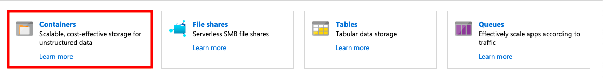

# Microsoft Academic Graph Guide #

The Microsoft Academic Graph (MAG) is a heterogeneous graph containing scientific publication records, citation relationships between those publications, as well as authors, institutions, journals, conferences, and fields of study. This graph is used to power experiences in Bing, Cortana, Word, and in Microsoft Academic. The graph is currently being updated on a weekly basis. 

In this tutorial, you are able to create a organization insights with MAG and PowerBI like this.

 

## Table of content ##

1. Prerequisite
2. Get Microsoft Academic Graph on Azure storage
3. Sign up for MAG provisioning
4. Set up Azure Data Lake Analytics (U-SQL) for Microsoft Academic Graph
5. MAG for Organization Insight

## Prerequisite

### Azure Subscription ###

Please create a new Azure subscription for the distribution previews. If your organization already using Azure, this could be a separate subscription under the same tenant id. If you start from scratch, for example “create Azure free account”, the subscription will be created under a new tenant id.

### Microsoft Power BI Desktop client ###

Microsoft Power BI Desktop is required to config U-SQL scripts and Azure Storage to Power BI Template for making a visualization samples for Microsoft Academic Graph. please visit [here](https://www.microsoft.com/en-us/download/details.aspx?id=58494) to download Microsoft Power BI Desktop.

## Get Microsoft Academic Graph on Azure storage ##

### Create an Azure Storage Account ###

1. Azure Portal > Create a resource > Storage > Storage account

    

2.  Provide following values to create an Azure Storage account. Then click "Review + create" button.

    |Property  |Description  |
    |---------|---------|
    |**Subscription** | From the drop-down, select your Azure subscription. |
    |**Resource group** | Specify whether you want to create a new resource group or use an existing one. A resource group is a container that holds related resources for an Azure solution. For more information, see [Azure Resource Group overview](https://docs.microsoft.com/azure/azure-resource-manager/resource-group-overview). |
    |**Storage account name** | Provide a name for your Databricks workspace, e.g. **magas<org_name>**. You don’t need to use your organization name after the "magas", however the account name must be unique among all Azure Storage Accounts. |
    |**Location**    | Select whatever location (region) that is most appropriate for your existing Azure resources |
    |**Performance** | Standard |
    |**Account kind**| StorageV2 (general purpose v2) |
    |**Replication** | LRS |
    |**Access tier** | Cool |

    

3. Verify that the information you entered is correct and click the "create" button

    

### Note Azure storage account name and primary key ###

1. Once notified that the storage account has been created, click “go to resource”

    

2. Go to “access keys” and take note of the “storage account name” and the “primary key”

    

3. Make sure that you have these items of information:

   * The name of your Azure Storage (AS) account.

   * The access key of Azure Storage (AS) account.

## Sign up for MAG provisioning ##

To sign up for MAG on AS distribution preview, send the following information using your school or company email account to <a href="mailto:academicapi@microsoft.com?subject=Access request to Microsoft Academic Graph (MAG) on Azure Storage (AS) distribution preview">academicapi@microsoft.com</a> with the subject "Access request to Microsoft Academic Graph (MAG) on Azure Storage (AS) distribution preview":

- Are you affiliated with a company or university?
  - If company, please provide the company’s name, your department/group and your role
  - If university, please provide the university’s name, department, group/advisor, and your role (undergraduate student, grad student, professor, etc.)
- Brief description of the project you will be using MAG for
- Name of your Microsoft sales representative, if you have one
- Azure Storage (AS) account name
- Azure Storage (AS) account primary access key
- Which type of provisioning model you want:
  1. One-time provisioning of the most recent MAG release
  1. Automatic provisioning of each new MAG release (~every 1-2 weeks)

> **NOTE**
>
> MAG is currently in a free preview period, so there are no charges associated with the provisioning or use of the data/service itself. However Azure requires you to cover all costs associated with standard resource creation, usage, etc. For cost estimates associated with MAG please see the [Pricing](https://docs.microsoft.com/en-us/academic-services/graph/resources-pricing) page.   Most research institutions have an "Enterprise Account" with Microsoft including Azure subscription. The pricing for Enterprise Accounts differ from the individual account shown in Azure's price calculator.   If you have an Enterprise Account, please check with your individual institution's Information Technology/Computer Center resource on the process of setting up Azure to get MAG. You might need to obtain a "Master Agreement #" and involve MLSP (Microsoft Licensed Solution Provider) for help.

## Set up Azure Data Lake Analytics (U-SQL) for Microsoft Academic Graph ##

### Create Azure Data Lake Analytics account ###

1. Home > Create a resource > Analytics > Data Lake Analytics

    

1. Create new Data Lake Analytics and Data Lake Storage Gen1 accounts, following the flow indicated in figure below:

    

    > [!IMPORTANT]
    > Both accounts require a globally unique name

1. Make sure that you have these items of information:

   * The name of your Azure Data Lake Analytics (ADLA) account

   * The name of your Azure Data Lake Storage (ADLS) account

### Configure Azure Data Lake Analytics to use Microsoft Academic Graph ###

1. Navigate to the new Azure Data Lake Analytics account created in the first section and add a new data source:

   

1. On the "add data source" dialog, select storage type "azure storage", selection method "select account" and the Azure Storage (AS) account you created for MAG provisioning:

   

## MAG for Organization Insight ##

### Gather the information that you need ###

   Before you begin, you should have these items of information:

   *  The name of your Azure Storage (AS) account containing MAG dataset 

   *  The name of your Azure Data Lake Analytics (ADLA)

   *  The name of your Azure Data Lake Storage (ADLS)

   *  The name of the container in your Azure Storage (AS) account containing MAG dataset.

### Create database from MAG data before running analytics examples ###

In prerequisite Set up Azure Data Lake Analytics, you added the Azure Storage  (AS) created for MAG provision as a data source for the Azure Data Lake Analytics service (ADLA). In this section, you submit an ADLA job to create database from MAG data.

1. In the [Azure portal](https://portal.azure.com), go to the Azure Data Lake Analytics (ADLA) service that you created, and select **Overview** > **New Job**.

   

1. To create a new job for creating database from MAG data, you need a Create Database USQL script. Please follow the steps below to get the CreateDatabase.usql script:

   1. Open a new browser window, go to [Azure portal](https://portal.azure.com) and go to **Storage account**.

   1. Go to your MAG stroage account and click **Containers**.
   

   1. Go to samples and click CreateDatabase.usql, download the CreateDatabase.usql.
   
   

1. Copy code in CreateDatabase.usql and paste into the code block.
   
1. Provide a **Job name** and select **Submit**.

   

1. The job should finish successfully.

#### Running Example Analytics ####
1. Download or clone the repository.
2. Open the solution **/src/AcademicAnalytics/12. Organization Insight**
3. The tutorial there should be: A USQL script(.usql), a Power BI report(.pbix), a Power BI template(.pbit) and a README explaining the tutorial. 
4. Althought each tutorial is different, running the USQL script as is and filling out the Power BI template using the same USQL parameters should give you a Power BI report with visualizations that match the Power BI report example included in the tutorial. Since the Microsoft Academic graph is contently improving, different graph verions may give you slightly different results.

#### Working with USQL scripts ####
1. In the [Azure portal](https://portal.azure.com), go to the Azure Data Lake Analytics (ADLA) service that you created, and select **Overview** > **New Job**.

   
   
2. Open the GenerateSubgraphForAffiliation.usql script at **/src/AcademicAnalytics/12. Organization Insight**

3. Copy code in GenerateSubgraphForAffiliation.usql and paste into the code block, and change the following parameters' value in the code:
   1. @organizationName: The name of the organization
      - All characters should be in small cases
      - You may find the correct organization name here: https://academic.microsoft.com/home
   2. @organizationPaperMinYear: The minimun year being searched from the organization
   
4. Provide a **Job name** and select **Submit**.

#### Using Power BI ####
- Make sure USQL script finished sucessfully
- Open up corresponding Power BI Template(.pbit) from file explorer (Visual studio doesn't recognize Power BI files) 
- Enter your ADL information and parameters corrisponding to your scripts

    - The ADL URI can be found at the **Data Lake Storage Gen1** on Azure Portal
- Make sure the parameters cases are the **same** as your script and "click" to load
